# CareerPilot AI – Premium Career Assistant & Resume Matcher

CareerPilot AI is a premium SaaS-grade dashboard designed to audit resumes, generate optimized career packages (tailored resumes, cover letters, and interview guides), and track job applications in a unified, professional workspace.

---

## 🎨 Visual Design System

The application is styled to match modern SaaS products (like Linear or Stripe) using custom CSS:
*   **Background**: A deep dark void (`#05080A`) with a geometric **Dot Field Grid** (`28px` spacing) and multi-layered **Teal Glow Gradients** in the viewport.
*   **Sidebar**: A **JeniKhant-inspired frosted glass panel** (`backdrop-filter: blur(25px)`, `rgba(10, 15, 17, 0.45)`) featuring a circular initials avatar, a clean muted list layout with horizontal rules (`sidebar-divider`), and modern Material Symbols.
*   **Typography**: Styled globally in **Tahoma** for sharp, readable, and structured hierarchy.
*   **Visual Highlights**: Subtle hover animation outlines (rounded teal borders) that light up on hover/active states.

---

## 🔄 Core User Workflow

```mermaid
sequenceDiagram
    autonumber
    actor User
    participant App as Streamlit Dashboard
    participant Model as Gemini 2.5 Flash
    participant Comp as LaTeX Compiler API

    User->>App: 1. Upload Resume & paste Job Description (Resume Analysis)
    App->>Model: Parse file & perform matching analysis
    Model-->>App: Return structured JSON & scores
    App->>User: Display ATS score, keyword gaps & priority suggestions (Dashboard)
    
    rect rgb(15, 23, 30)
        Note over User, App: Career Prep & Optimization Loop
        User->>App: 2. Review matching/missing skills (Skill Analysis)
        User->>App: 3. Rewrite resume bullet points using AI (Resume Rewriter)
        User->>App: 4. Generate custom cover letter (Cover Letter)
        User->>App: 5. Chat with coach or run mock interview simulation (Coach & Prep)
    end

    rect rgb(10, 30, 20)
        Note over User, App: Export & Tracking
        User->>App: 6. Select LaTeX template (Templates Gallery)
        App->>Comp: 7. Render Jinja2 LaTeX source & compile PDF
        Comp-->>App: Return compiled PDF binary
        App->>User: 8. Download PDF, DOCX, MD, or Tex source files (Download PDF)
        User->>App: 9. Log application into database ledger (Career Analytics)
    end
```



---

## 📂 Page-by-Page Feature Summary

### 1. Command Center (Dashboard)
*   Displays critical match metrics: **ATS Score**, **Keyword Coverage**, and counts of **Matched / Missing Skills**.
*   Hosts circular visual progress rings.
*   Shows a list of recently analyzed resumes and provides quick navigation actions.

### 2. Resume Upload (Resume Analysis)
*   Features a custom drag-and-drop container for PDF and DOCX files.
*   Accepts target Job Description texts.
*   Triggers the `gemini-2.5-flash` analytics engine.

### 3. Skill Auditor (Skill Analysis)
*   Groups candidate profile keywords into **Matched Skills**, **Missing Skills**, and **Recommended Adjacent Skills** to guide content refinement.

### 4. Strategic Feedback (AI Suggestions)
*   Yields prioritized recommendations (Critical, High, Medium, Low) to bypass ATS filters and catch recruiters' attention.

### 5. Content Editor (Resume Rewriter)
*   AI-rewrites profile summaries, employment bullet points, and project details to organically integrate missing job description keywords.
*   Displays a side-by-side "Original vs. Optimized" view for verification.

### 6. Cover Letter Generator
*   Generates a professional 300–400 word business-formal cover letter matching the target role, downloadable as a text file.

### 7. AI Career Coach (Career Assistant)
*   A responsive chat interface preloaded with the candidate's parsed resume, job description, and match results.

### 8. Interview Prep & Simulator
*   **Guide**: Generates a set of 10 customized technical and behavioral interview questions with sample answers.
*   **Simulator**: An interactive mock simulator that guides the user through questions, receives responses, grades them out of 10, and suggests improvements.

### 9. PDF Package & LaTeX Exports
*   **Templates Gallery**: Choose between **VIT Academic Risk** (serif/compact), **Classic Lines** (clean lines), and **PwC Modern** (dual-column) layouts.
*   **Resume Generator**: Translates the parsed resume JSON into LaTeX source code, with a built-in text editor for manual tweaks.
*   **LaTeX Generator**: Calls a unified compiler that compiles the LaTeX code using system TeX tools, or falls back to public APIs (`texlive.net` or `latexonline.cc`).
*   **Download PDF**: Downloads the package in PDF, Word (`.docx`), Markdown (`.md`), or raw Text formats.

### 10. Ledger & Analytics
*   **Resume History**: Compares match scores and metadata across multiple resume drafts.
*   **Career Analytics**: A pipeline tracker that displays job search metrics (e.g. applications count by status, match scores by company) in Plotly charts, and features a ledger to add/update job applications.

---

## 🚀 How to Run

1. **Clone the repository**:
   ```bash
   git clone https://github.com/Devika7447/AI-Resume-Job-Match-Assistant.git
   cd AI-Resume-Job-Match-Assistant
   ```
2. **Install dependencies**:
   ```bash
   pip install -r requirements.txt
   ```
3. **Configure Environment variables**:
   Create a `.env` file in the root folder and add your Gemini API Key:
   ```env
   GOOGLE_API_KEY=your_gemini_api_key_here
   ```
4. **Run the Streamlit Dashboard**:
   ```bash
   streamlit run app.py
   ```
